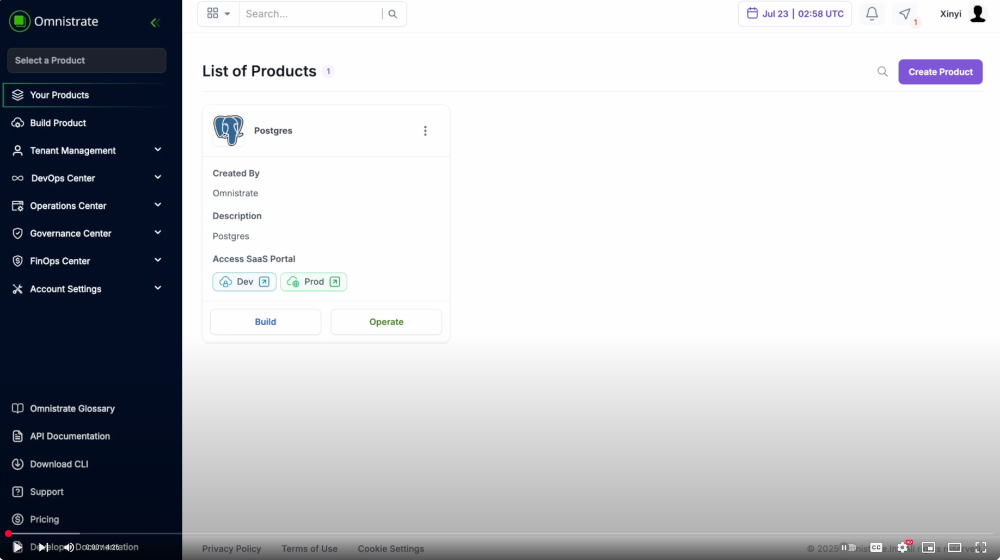
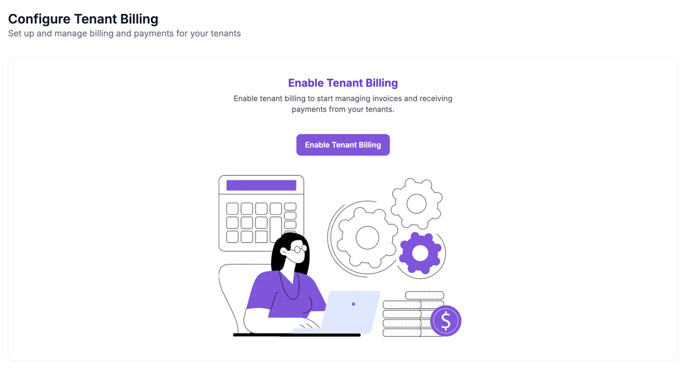
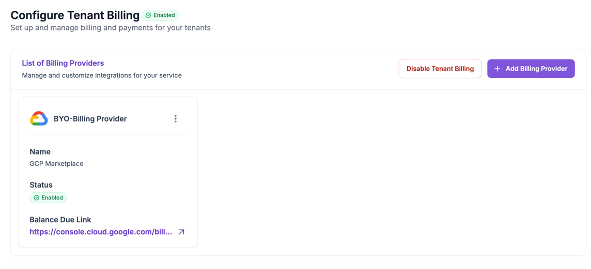
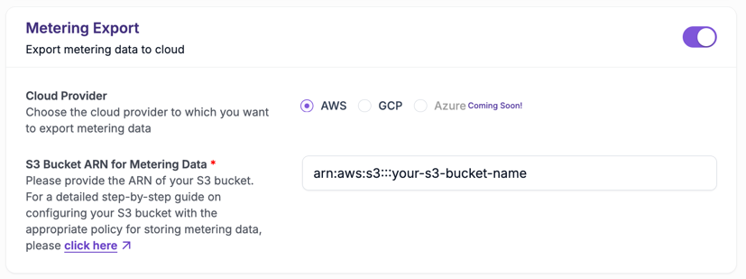
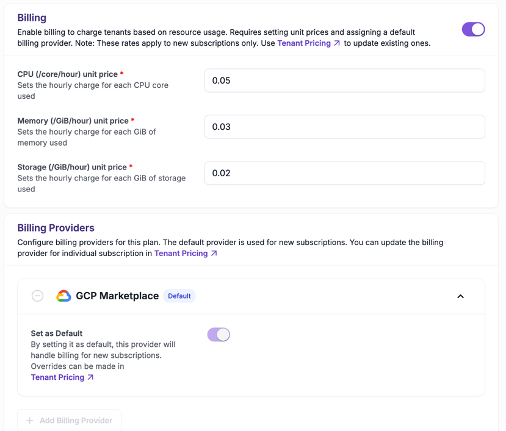
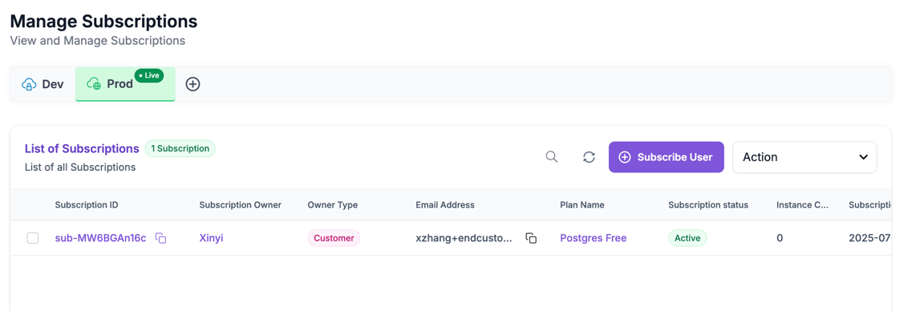
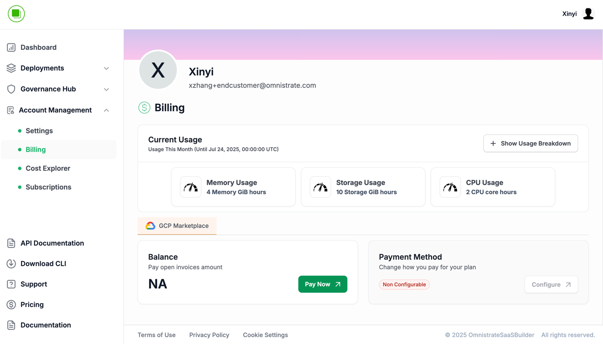
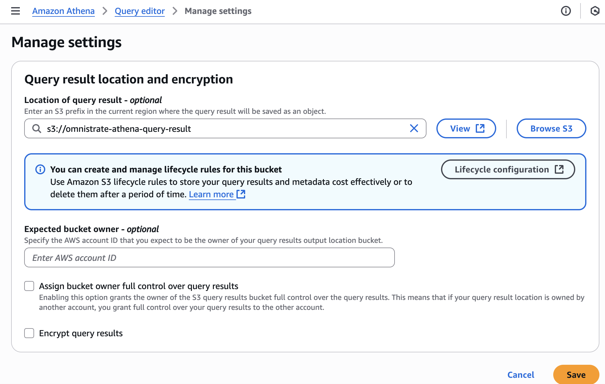
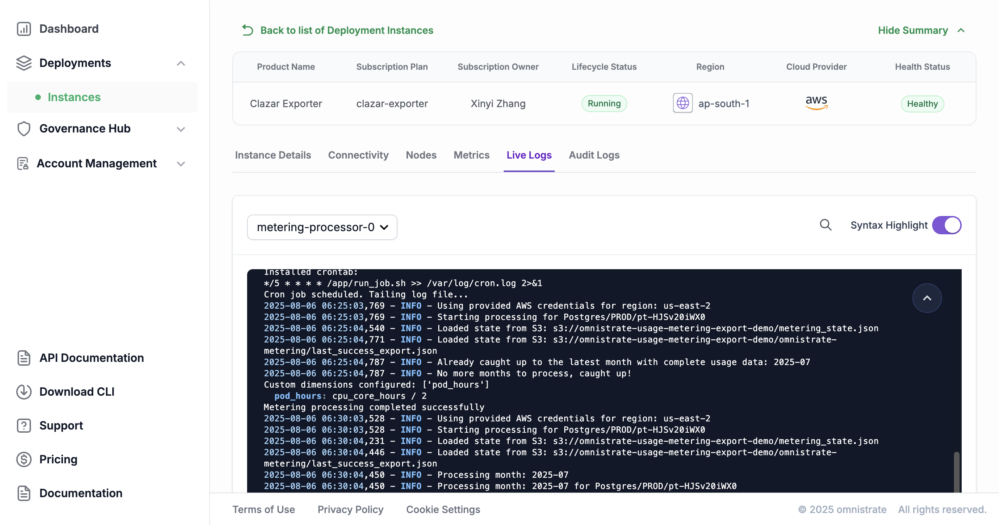

# Integrating Billing with GCP Marketplace

Demo Video:
[](https://www.youtube.com/watch?v=Y4nk05R3_1k)

This guide walks you through the steps required to integrate your Omnistrate-hosted SaaS service with **Google Cloud Platform (GCP) Marketplace**. By the end, you'll be able to configure automated billing, enable detailed usage metering, and manage customer subscriptions—all within a scalable, cloud-native workflow. You’ll also learn how to export metering data to cloud storage and analyze it using Amazon Athena (if exporting to AWS S3).

---

## 1. Enabling Tenant Billing

Before any billing or metering features can be configured, you must first enable tenant billing within Omnistrate. This unlocks key capabilities such as billing provider integration, usage tracking, and pricing configuration.

To begin, navigate to the **Tenant Billing** section in the Omnistrate dashboard. Click on **Enable tenant billing** to activate billing features across your tenant environments. Once enabled, Omnistrate will allow you to define billing relationships and associate metering and pricing configurations with tenant-specific service plans.



---

## 2. Adding a Billing Provider

Once tenant billing is enabled, the next step is to configure GCP Marketplace as your billing provider. This allows Omnistrate to route all future billing events and charges through your GCP subscription management pipeline.

Go to **Tenant Billing > Billing Providers**, and click **Add Billing Provider**. You’ll be prompted to enter details such as the provider's **Name** (enter `GCP Marketplace`), an optional **Logo** image for branding, and a **Balance Due URL** (if you'd like customers to view their invoices externally). After filling out the information, click **Save**. Your newly added billing provider will now be available to link with specific service plans and customer subscriptions.


---

## 3. Enabling Usage Metering

Usage metering tracks how much of your service is being consumed and exports this data to a cloud storage bucket of your choice. This data forms the basis for billing customers accurately, especially for usage-based pricing models.

To enable metering, go to **Service Plans** and select the specific service and environment (e.g., `PROD`) for which you want to activate billing. Click **Modify Service Plan**, then enable the **Metering Export** toggle. You will then select your cloud provider:

* If you're using **AWS**, enter your **S3 bucket ARN** (e.g., `arn:aws:s3:::omnistrate-usage-data`).
* For **GCP**, provide your **GCS bucket name**.

Make sure you complete the required IAM setup so that Omnistrate’s service account has permission to write metering data to your designated bucket. Once configured, usage records will be written to a path under `omnistrate-metering/` within the bucket.


---

## 4. Enabling Billing for a Service Plan

With metering in place, the next step is to link the service plan to your billing provider.

Modify the relevant **Service Plan** and enable billing. Under **Billing Provider**, select `GCP Marketplace`, then mark it as the **Default Billing Provider** for this service plan. Doing so ensures that any new subscriptions to this plan will be automatically set to use GCP Marketplace for billing.



Note that you may ignore the **Pricing** section for now and just use placeholder values. The actual pricing is defined in your GCP Marketplace listing; you just need to export the usage data to GCP for billing purposes. Refer to the following steps to see how to do this.

---

## 5. Managing Marketplace Subscriptions

When a customer subscribes to your service via GCP Marketplace, Omnistrate will notify you of the new subscription. You'll then need to create or associate a user account and map the subscription accordingly.

Start by navigating to **Tenant Management > Configure Tenants**. Here, click **Add User** and provide details such as the user’s name, email address, and any relevant metadata. You can optionally enable **Auto-verification**, which allows the user to access their environment immediately.

Next, go to **Operations Center > Subscriptions** and click **Add Subscription**. Search for and link the user you just created, then assign them the correct service plan. After that, head to **FinOps Center > Tenant Pricing** to define the customer’s billing terms. This includes specifying **Pricing**, **Usage Quotas**, and an **External Billing ID**—such as the contract id that links this customer to your listing on GCP Marketplace. These details ensure that usage is properly metered and billed through the appropriate channel.


---

## 6. Customer Experience Overview

Once subscribed, your customers will log into Omnistrate and have full access to their service environment. They can view the service plan they’ve subscribed to, create and manage their own instances, and monitor usage metrics in near real-time.

Customers can also navigate to the **Billing** section in their dashboard, where they will find their historical usage, current billing status, and remaining quota (if applicable). This transparency helps customers understand their consumption and cost structure, enhancing trust and reducing billing disputes.


---

## 7. Analyzing Usage Data with Amazon Athena (AWS Only)

If you've opted to export usage data to **Amazon S3**, you can use **Amazon Athena** to run SQL queries against this data—helpful for generating internal reports, debugging customer usage, or forecasting revenue.

A typical usage file might reside at a path like:

```
omnistrate-metering/Postgres/PROD/pt-HJSv20iWX0/2025/07/23/21/sub-I8QCrIrOIE.json
```

Each file contains structured JSON data, such as:

```json
[
  {
    "timestamp": "2025-07-23T22:02:40Z",
    "organizationId": "org-ng3178atx4",
    "organizationName": "Omnistrate",
    "customerId": "user-wqo8MXGOWw",
    "customerEmail": "your-customer-email",
    "subscriptionId": "sub-I8QCrIrOIE",
    "externalPayerId": "user-abcd1234",
    "serviceId": "s-P6UJ5XUunY",
    "serviceName": "Postgres",
    "serviceEnvironmentId": "se-6dkTBqXrUu",
    "serviceEnvironmentType": "PROD",
    "productTierId": "pt-HJSv20iWX0",
    "productTierName": "Postgres Free",
    "hostClusterId": "hc-pelsk80ph",
    "instanceId": "instance-8qtgw2dx7",
    "podName": "postgres-0",
    "instanceType": "t3.medium",
    "hostName": "ip-172-0-48-88.us-east-2.compute.internal",
    "dimension": "cpu_core_hours",
    "value": 2
  },
  ...
]
```

Before querying, set up an Athena destination bucket to store query results.
1. **Create a Result Bucket in S3** (if not already present).
2. **Set Athena Query Result Location** to this new bucket.


Next, create a database in Athena with the following command:

```sql
CREATE DATABASE IF NOT EXISTS customer_usage;
```

Then, define an external table that points to your metering data:

```sql
CREATE EXTERNAL TABLE IF NOT EXISTS customer_usage.json_raw_data (
  json_str string
)
LOCATION 's3://omnistrate-usage-metering-export-demo/omnistrate-metering/';
```

Finally, you can run queries like the one below to extract and aggregate monthly usage across services and customers:

```sql
WITH raw_data AS (
    SELECT CAST(json_parse(json_str) AS ARRAY(JSON)) AS nested_json_array
    FROM customer_usage.json_raw_data
),
     unnested_raw_data AS (
         SELECT json_record
         FROM raw_data
                  CROSS JOIN UNNEST(nested_json_array) AS t(json_record)
     ),
     parsed_data AS (
         SELECT
             json_extract_scalar(json_record, '$.timestamp') AS timestamp,
             json_extract_scalar(json_record, '$.organizationId') AS serviceOwnerId,
             json_extract_scalar(json_record, '$.externalPayerId') AS externalPayerId,
             json_extract_scalar(json_record, '$.serviceId') AS serviceId,
             json_extract_scalar(json_record, '$.serviceName') AS serviceName,
             json_extract_scalar(json_record, '$.serviceEnvironmentId') AS serviceEnvironmentId,
             json_extract_scalar(json_record, '$.serviceEnvironmentType') AS serviceEnvironmentName,
             json_extract_scalar(json_record, '$.productTierId') AS productTierId,
             json_extract_scalar(json_record, '$.productTierName') AS productTierName,
             json_extract_scalar(json_record, '$.dimension') AS dimensionId,
             json_extract_scalar(json_record, '$.podName') AS podName,
             json_extract_scalar(json_record, '$.instanceId') AS instanceId,
             json_extract_scalar(json_record, '$.hostName') AS resourceId,
             json_extract_scalar(json_record, '$.value') AS value
         FROM unnested_raw_data
     ),

-- CTE to aggregate usage data by hour, day, and month
     hourly_usage_data AS (
         SELECT
             DATE_FORMAT(from_iso8601_timestamp(timestamp), '%Y-%m') AS month,
             DATE_FORMAT(from_iso8601_timestamp(timestamp), '%Y-%m-%d') AS day,
             DATE_FORMAT(from_iso8601_timestamp(timestamp), '%Y-%m-%dT%H:00:00Z') AS datehour,

             serviceOwnerId,
             externalPayerId,
             serviceId,
             serviceName,
             serviceEnvironmentId,
             serviceEnvironmentName,
             productTierId,
             productTierName,
             dimensionId,
             podName,
             instanceId,
             resourceId,

             MAX(CAST(value AS BIGINT)) AS total
         FROM parsed_data
         GROUP BY
             DATE_FORMAT(from_iso8601_timestamp(timestamp), '%Y-%m'),
             DATE_FORMAT(from_iso8601_timestamp(timestamp), '%Y-%m-%d'),
             DATE_FORMAT(from_iso8601_timestamp(timestamp), '%Y-%m-%dT%H:00:00Z'),
             serviceOwnerId,
             externalPayerId,
             serviceId,
             serviceName,
             serviceEnvironmentId,
             serviceEnvironmentName,
             productTierId,
             productTierName,
             dimensionId,
             podName,
             instanceId,
             resourceId
     )

-- Final SELECT to retrieve and display aggregated data
SELECT
    month,
    serviceOwnerId,
    externalPayerId,
    serviceId,
    serviceName,
    serviceEnvironmentId,
    serviceEnvironmentName,
    productTierId,
    productTierName,
    dimensionId,
    SUM(total) AS total
FROM hourly_usage_data
GROUP BY
    month,
    serviceOwnerId,
    externalPayerId,
    serviceId,
    serviceName,
    serviceEnvironmentId,
    serviceEnvironmentName,
    productTierId,
    productTierName,
    dimensionId
ORDER BY
    month,
    total DESC;
```

This query aggregates usage by month and service dimension (e.g., CPU core hours), making it easy to report on customer activity and validate billing totals. You can adapt the query further to generate daily usage, group by customer email, or analyze trends across service tiers.

---

## 8. Automating Usage Export to GCP

While usage metering provides a way to track customer consumption, automating the reporting process ensures timely and accurate billing through GCP Marketplace.

Omnistrate supports running a scheduled export job that processes usage data stored in your S3 bucket and sends it to your billing provider. Although the example below uses **Clazar**, the same approach can be adapted for other billing systems.

### Step 1: Use the Ready-Made Recipe

To simplify setup, we’ve created a recipe that includes:

* A cron job that runs every 5 minutes
* Logic to detect when complete usage data for the month is available
* Automation to send the data to your billing provider

Start by forking the [Clazar Export Recipe](https://github.com/omnistrate-community/usage-export-clazar-recipe) repository. Then, clone it locally and run the following command:

```bash
omctl build-from-repo --product-name "Clazar Exporter"
```

This command:

* Builds the Docker image from the recipe
* Pushes it to the GitHub Container Registry
* Creates a service plan from the recipe in your Omnistrate tenant

### Step 2: Create the Export Job Instance

1. Go to the **SaaS Portal**.
2. Create a **resource instance** based on the Clazar Export Job.
3. During creation, fill in all required parameters such as:

    * GCS bucket name
    * Dimensions to track (CPU, memory, storage, replica, etc.)
    * Any necessary credentials
4. You can also define custom usage formulas based on multiple dimensions.

Once the instance is created, the job will begin running automatically on a 5-minute interval.

### Step 3: Monitor the Export Job

After setup:

* Logs from the cron job will be visible directly in the Omnistrate portal.
* You'll be able to confirm when the usage data is sent to your billing provider.
* The system ensures that only complete monthly data is sent, preventing partial billing.



For more details on how to configure the export job, refer to the [Clazar Export Recipe](https://github.com/omnistrate-community/usage-export-clazar-recipe).

### Flexibility Across Providers

Even though this recipe uses Clazar as the target billing provider, the logic can be adapted for any system that supports usage-based billing via API. Simply modify the export logic in the recipe to align with your provider's data schema and endpoint.


By automating this flow, you eliminate the need for manual exports or reports, and ensure your usage data is delivered to GCP Marketplace (or any billing system) reliably and on time.


## What's Next?

We will continue to enhance this experience by automating the setting of the **External Billing ID** in the service plan, which will allow you to link customer subscriptions directly to your GCP Marketplace listing. This will streamline the billing process even further, reducing manual steps and ensuring that all customer usage is accurately captured and billed.

For more information on FinOps, refer to the [FinOps Guide](../../fin-ops-guides/overview.md).