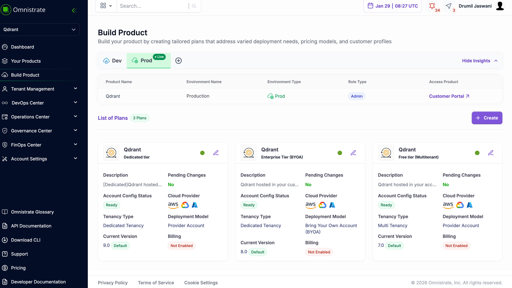
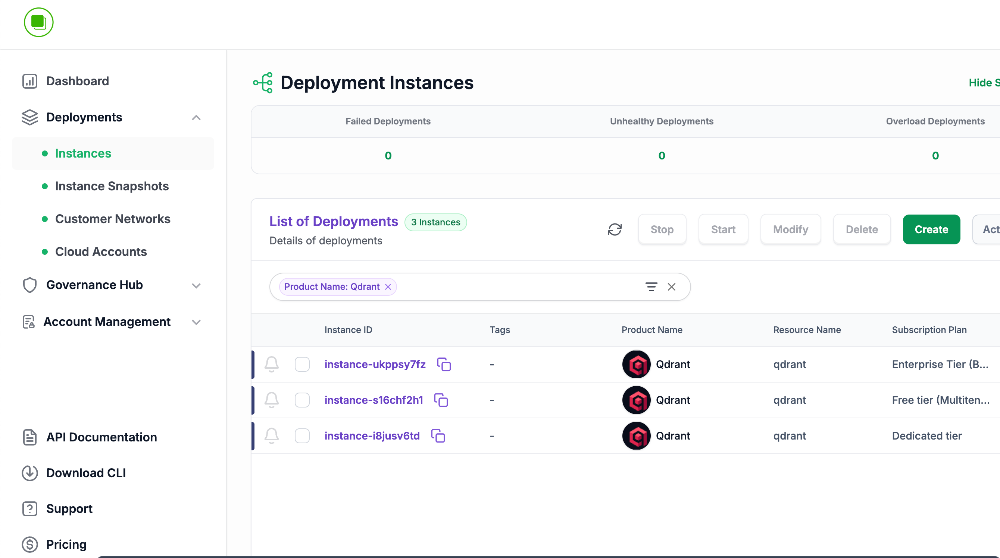
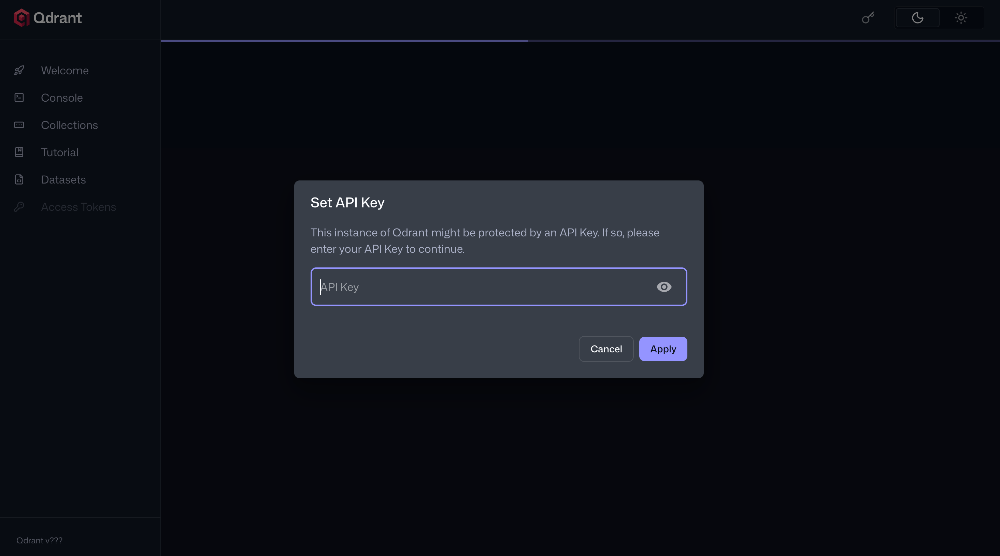
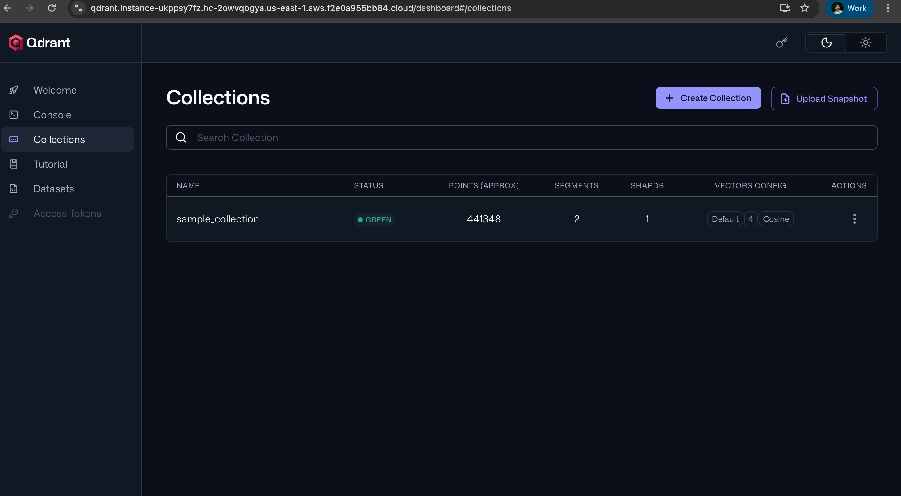

# Qdrant Vector Database SaaS

This example demonstrates how to build a Qdrant vector database SaaS offering with three distinct service plans. Each plan is designed for different customer segments, from cost-conscious startups to enterprise customers requiring dedicated infrastructure or deployment in their own cloud accounts.

## Summary

The example showcases three service plans that progressively offer more isolation and control:

| Plan | Tenancy Model | Deployment | Best For |
|------|---------------|------------|----------|
| Free Tier (Multitenant) | Shared infrastructure | Provider's account | Startups, testing, development |
| Dedicated Tier | Dedicated infrastructure | Provider's account | Production workloads, performance-sensitive applications |
| Enterprise Tier (BYOA) | Dedicated infrastructure | Customer's account | Enterprise customers, compliance requirements |



All three plans share common features:
- **Qdrant vector database** with REST API (port 6333) and gRPC (port 6334)
- **Persistent storage** with cloud-native block storage (EBS, PD, Premium SSD)
- **API key authentication** for securing access
- **HTTP reverse proxy** for secure external access
- **Automated backups** with configurable retention

---

## Plan 1: Free Tier (Multitenant)

The multitenant plan provides a cost-efficient option where multiple customers share the underlying infrastructure. This is ideal for free tiers, development environments, or customers with cost constraints.

### Key Features Enabled

| Feature | Configuration | Purpose |
|---------|---------------|---------|
| Multi-tenancy | `OMNISTRATE_MULTI_TENANCY` | Shares infrastructure across customers to reduce costs |
| Hosted Deployment | `hostedDeployment` | Deploys in your (provider's) cloud account |
| Omnistrate Metrics | `x-omnistrate-integrations` | Built-in metrics collection |
| Omnistrate Logging | `x-omnistrate-integrations` | Built-in log aggregation |
| HTTP Reverse Proxy | `httpReverseProxy` | Secure HTTPS access to REST API |
| Automated Backups | `backupConfiguration` | 7-day retention with 2-hour backup intervals |

### How Features Are Configured

**Service Plan & Tenancy**

The `x-omnistrate-service-plan` section defines the plan name and tenancy type:

```yaml
x-omnistrate-service-plan:
  name: "Free tier (Multitenant)"
  tenancyType: "OMNISTRATE_MULTI_TENANCY"
```

Setting `tenancyType` to `OMNISTRATE_MULTI_TENANCY` enables shared infrastructure where multiple customers run on the same underlying resources.

**Provider-Hosted Deployment**

The `hostedDeployment` section specifies your cloud provider accounts:

```yaml
deployment:
  hostedDeployment: 
    AwsAccountId: '<AWS_ACCOUNT_ID>'
    AwsBootstrapRoleAccountArn: 'arn:aws:iam::<AWS_ACCOUNT_ID>:role/omnistrate-bootstrap-role'
    gcpProjectId: '<GCP_PROJECT_ID>'
    gcpProjectNumber: '<GCP_PROJECT_NUMBER>'
    gcpServiceAccountEmail: '<GCP_SERVICE_ACCOUNT_EMAIL>'
    azureSubscriptionId: '<AZURE_SUBSCRIPTION_ID>'
    azureTenantId: '<AZURE_TENANT_ID>'
```

**Built-in Observability**

Omnistrate's native metrics and logging are enabled via integrations:

```yaml
x-omnistrate-integrations:
  - omnistrateMetrics
  - omnistrateLogging
```


**Capabilities**

The HTTP reverse proxy and backup configuration are defined at the service level:

```yaml
x-omnistrate-capabilities:
  httpReverseProxy:
    targetPort: 6333
  backupConfiguration:
    backupRetentionInDays: 7
    backupPeriodInHours: 2
```

### Complete Spec

```yaml
# -------------------------------------------------------------------------
# PLAN 1: Multitenant (Cost-efficient, shared infrastructure)
# -------------------------------------------------------------------------
version: '3.9'

x-omnistrate-service-plan:
  name: "Free tier (Multitenant)"
  tenancyType: "OMNISTRATE_MULTI_TENANCY"
  deployment:
    hostedDeployment: 
      AwsAccountId: '<AWS_ACCOUNT_ID>'
      AwsBootstrapRoleAccountArn: 'arn:aws:iam::<AWS_ACCOUNT_ID>:role/omnistrate-bootstrap-role'
      gcpProjectId: '<GCP_PROJECT_ID>'
      gcpProjectNumber: '<GCP_PROJECT_NUMBER>'
      gcpServiceAccountEmail: '<GCP_SERVICE_ACCOUNT_EMAIL>'
      azureSubscriptionId: '<AZURE_SUBSCRIPTION_ID>'
      azureTenantId: '<AZURE_TENANT_ID>'
# Enable built-in logging and metrics for your customers
x-omnistrate-integrations:
  - omnistrateMetrics
  - omnistrateLogging
services:
  qdrant:
    image: qdrant/qdrant:latest
    working_dir: /qdrant/storage
    # Omnistrate handles port mapping; 6333 is the REST API, 6334 is gRPC
    ports:
      - 6333:6333
      - 6334:6334
    expose:
      - 6333
      - 6334
      - 6335
    environment:
      - QDRANT__STORAGE__STORAGE_PATH=/qdrant/storage/data
      - QDRANT__STORAGE__SNAPSHOTS_PATH=/qdrant/storage/snapshots
      # Use Omnistrate API params to let customers set their own API Key
      - QDRANT__SERVICE__API_KEY=$var.apikey
        
    # Define storage parameters
    volumes:
      - source: ./qdrant_data
        target: /qdrant/storage
        type: bind
        x-omnistrate-storage:
          aws:
            instanceStorageType: AWS::EBS_GP3
            instanceStorageSizeGi: 10
            instanceStorageIOPS: 3000
            instanceStorageThroughputMiBps: 125
          gcp:
            instanceStorageType: GCP::PD_BALANCED
            instanceStorageSizeGi: 10
          azure:
            instanceStorageType: AZURE::PREMIUM_SSD
            instanceStorageSizeGi: 10
    # Define how customers can configure the service via API/UI
    x-omnistrate-api-params:
      - key: apikey
        name: API_KEY
        description: "The API Key for securing your Qdrant instance"
        required: true
        type: String
    x-omnistrate-capabilities:
      httpReverseProxy:
        targetPort: 6333
      backupConfiguration:
        backupRetentionInDays: 7
        backupPeriodInHours: 2
```

---

## Plan 2: Dedicated Tier

The dedicated tier provides each customer with their own isolated infrastructure while still deploying in the provider's cloud account. This offers better performance isolation and is suitable for production workloads.

### Key Features Enabled

| Feature | Configuration | Purpose |
|---------|---------------|---------|
| Dedicated Tenancy | `OMNISTRATE_DEDICATED_TENANCY` | Dedicated infrastructure per customer |
| Hosted Deployment | `hostedDeployment` | Deploys in your (provider's) cloud account |
| Omnistrate Metrics | `x-omnistrate-integrations` | Built-in metrics collection |
| Omnistrate Logging | `x-omnistrate-integrations` | Built-in log aggregation |
| HTTP Reverse Proxy | `httpReverseProxy` | Secure HTTPS access to REST API |
| Automated Backups | `backupConfiguration` | 7-day retention with 2-hour backup intervals |

### How Features Are Configured

**Dedicated Tenancy**

The key difference from the multitenant plan is the `tenancyType`:

```yaml
x-omnistrate-service-plan:
  name: 'Dedicated Tier'
  tenancyType: "OMNISTRATE_DEDICATED_TENANCY"
```

Setting `tenancyType` to `OMNISTRATE_DEDICATED_TENANCY` ensures each customer gets their own isolated compute and storage resources.

**Provider-Hosted Deployment**

Like the multitenant plan, this deploys in your cloud accounts but with dedicated resources per customer:

```yaml
deployment:
  hostedDeployment: 
    AwsAccountId: '<AWS_ACCOUNT_ID>'
    AwsBootstrapRoleAccountArn: 'arn:aws:iam::<AWS_ACCOUNT_ID>:role/omnistrate-bootstrap-role'
```

### Complete Spec

```yaml
# -------------------------------------------------------------------------
# PLAN 2: Dedicated
# -------------------------------------------------------------------------
version: '3.9'
x-omnistrate-service-plan:
  name: 'Dedicated Tier'
  tenancyType: "OMNISTRATE_DEDICATED_TENANCY"
  deployment:
    hostedDeployment: 
      AwsAccountId: '<AWS_ACCOUNT_ID>'
      AwsBootstrapRoleAccountArn: 'arn:aws:iam::<AWS_ACCOUNT_ID>:role/omnistrate-bootstrap-role'
      gcpProjectId: '<GCP_PROJECT_ID>'
      gcpProjectNumber: '<GCP_PROJECT_NUMBER>'
      gcpServiceAccountEmail: '<GCP_SERVICE_ACCOUNT_EMAIL>'
      azureSubscriptionId: '<AZURE_SUBSCRIPTION_ID>'
      azureTenantId: '<AZURE_TENANT_ID>'
# Enable built-in logging and metrics for your customers
x-omnistrate-integrations:
  - omnistrateMetrics
  - omnistrateLogging

services:
  qdrant:
    image: qdrant/qdrant:latest
    working_dir: /qdrant/storage
    # Omnistrate handles port mapping; 6333 is the REST API, 6334 is gRPC
    ports:
      - 6333:6333
      - 6334:6334
    expose:
      - 6333
      - 6334
      - 6335
    environment:
      - QDRANT__STORAGE__STORAGE_PATH=/qdrant/storage/data
      - QDRANT__STORAGE__SNAPSHOTS_PATH=/qdrant/storage/snapshots
      # Use Omnistrate API params to let customers set their own API Key
      - QDRANT__SERVICE__API_KEY=$var.apikey
        
    # Define storage parameters
    volumes:
      - source: ./qdrant_data
        target: /qdrant/storage
        type: bind
        x-omnistrate-storage:
          aws:
            instanceStorageType: AWS::EBS_GP3
            instanceStorageSizeGi: 10
            instanceStorageIOPS: 3000
            instanceStorageThroughputMiBps: 125
          gcp:
            instanceStorageType: GCP::PD_BALANCED
            instanceStorageSizeGi: 10
          azure:
            instanceStorageType: AZURE::PREMIUM_SSD
            instanceStorageSizeGi: 10
    # Define how customers can configure the service via API/UI
    x-omnistrate-api-params:
      - key: apikey
        name: API_KEY
        description: "The API Key for securing your Qdrant instance"
        required: true
        type: String
    x-omnistrate-capabilities:
      httpReverseProxy:
        targetPort: 6333
      backupConfiguration:
        backupRetentionInDays: 7
        backupPeriodInHours: 2
```

---

## Plan 3: Enterprise Tier (BYOA)

The Enterprise tier enables Bring Your Own Account (BYOA) deployment, allowing customers to run the Qdrant service in their own cloud accounts. This provides maximum control, data sovereignty, and compliance capabilities.


### Key Features Enabled

| Feature | Configuration | Purpose |
|---------|---------------|---------|
| BYOA Deployment | `byoaDeployment` | Deploys in customer's cloud account |
| Customer Integrations | `x-customer-integrations` | Logs and metrics with custom Qdrant metrics |
| Internal Integrations | `x-internal-integrations` | Native provider observability |
| Custom Metrics | `additionalMetrics` | Qdrant-specific Prometheus metrics |
| HTTP Reverse Proxy | `httpReverseProxy` | Secure HTTPS access to REST API |
| Automated Backups | `backupConfiguration` | 7-day retention with 2-hour backup intervals |

### How Features Are Configured

**BYOA Deployment**

The `byoaDeployment` section enables deployment in customer accounts. Your account acts as an intermediary:

```yaml
x-omnistrate-service-plan:
  name: 'Enterprise Tier (BYOA)'
  deployment:
    byoaDeployment:
      AwsAccountId: '<AWS_ACCOUNT_ID>'
      AwsBootstrapRoleAccountArn: 'arn:aws:iam::<AWS_ACCOUNT_ID>:role/omnistrate-bootstrap-role'
```

**Customer Integrations with Custom Metrics**

The `x-customer-integrations` section enables logs and metrics for customers, including custom Qdrant-specific metrics scraped from the Prometheus endpoint:

```yaml
x-customer-integrations:
  logs:
  metrics:
    additionalMetrics:
      qdrant:
        prometheusEndpoint: "http://localhost:6333/metrics"
        metrics:
          collections_total:
          collections_vector_total:
          grpc_responses_total:
          rest_responses_total:
```

This configuration scrapes Qdrant's built-in Prometheus metrics endpoint and exposes key metrics:
- `collections_total` - Total number of collections
- `collections_vector_total` - Total vectors across collections
- `grpc_responses_total` - gRPC API response count
- `rest_responses_total` - REST API response count

**Internal Integrations**

Native log and metrics providers are enabled for internal observability:

```yaml
x-internal-integrations:
  logs:
    provider: native
  metrics:
    provider: native
```

### Complete Spec

```yaml
version: '3.9'
x-omnistrate-service-plan:
  name: 'Enterprise Tier (BYOA)'
  deployment:
    byoaDeployment:
      AwsAccountId: '<AWS_ACCOUNT_ID>'
      AwsBootstrapRoleAccountArn: 'arn:aws:iam::<AWS_ACCOUNT_ID>:role/omnistrate-bootstrap-role'
# Enable built-in logging and metrics for your customers
x-customer-integrations:
  logs:
  metrics:
    additionalMetrics:
      qdrant:
        prometheusEndpoint: "http://localhost:6333/metrics"
        metrics:
          collections_total:
          collections_vector_total:
          grpc_responses_total:
          rest_responses_total:
  
x-internal-integrations:
  logs:
    provider: native
  metrics:
    provider: native

services:
  qdrant:
    image: qdrant/qdrant:latest
    working_dir: /qdrant/storage
    # Omnistrate handles port mapping; 6333 is the REST API, 6334 is gRPC
    ports:
      - 6333:6333
      - 6334:6334
    expose:
      - 6333
      - 6334
      - 6335
    environment:
      - QDRANT__STORAGE__STORAGE_PATH=/qdrant/storage/data
      - QDRANT__STORAGE__SNAPSHOTS_PATH=/qdrant/storage/snapshots
      # Use Omnistrate API params to let customers set their own API Key
      - QDRANT__SERVICE__API_KEY=$var.apikey
        
    # Define storage parameters
    volumes:
      - source: ./qdrant_data
        target: /qdrant/storage
        type: bind
        x-omnistrate-storage:
          aws:
            instanceStorageType: AWS::EBS_GP3
            instanceStorageSizeGi: 10
            instanceStorageIOPS: 3000
            instanceStorageThroughputMiBps: 125
          gcp:
            instanceStorageType: GCP::PD_BALANCED
            instanceStorageSizeGi: 10
          azure:
            instanceStorageType: AZURE::PREMIUM_SSD
            instanceStorageSizeGi: 10
    # Define how customers can configure the service via API/UI
    x-omnistrate-api-params:
      - key: apikey
        name: API_KEY
        description: "The API Key for securing your Qdrant instance"
        required: true
        type: String
    x-omnistrate-capabilities:
      httpReverseProxy:
        targetPort: 6333
      backupConfiguration:
        backupRetentionInDays: 7
        backupPeriodInHours: 2
```

---

## Common Configuration Elements

All three plans share several configuration patterns:

### Storage Configuration

Cloud-native block storage is configured per provider:

```yaml
x-omnistrate-storage:
  aws:
    instanceStorageType: AWS::EBS_GP3
    instanceStorageSizeGi: 10
    instanceStorageIOPS: 3000
    instanceStorageThroughputMiBps: 125
  gcp:
    instanceStorageType: GCP::PD_BALANCED
    instanceStorageSizeGi: 10
  azure:
    instanceStorageType: AZURE::PREMIUM_SSD
    instanceStorageSizeGi: 10
```

### API Parameters

Customer-configurable parameters are defined via `x-omnistrate-api-params`:

```yaml
x-omnistrate-api-params:
  - key: apikey
    name: API_KEY
    description: "The API Key for securing your Qdrant instance"
    required: true
    type: String
```

### Capabilities

Common capabilities across all plans:

```yaml
x-omnistrate-capabilities:
  httpReverseProxy:
    targetPort: 6333
  backupConfiguration:
    backupRetentionInDays: 7
    backupPeriodInHours: 2
```

---

## See It In Action




---

## Next Steps

After building your initial Qdrant SaaS, you can continue to evolve your offering:

- Add [autoscaling](../../runtime-guides/overview.md) for dynamic scaling based on load
- Configure [serverless capabilities](../../runtime-guides/serverless.md) for cost optimization
- Implement [custom action hooks](../../build-guides/actionhooks.md) for automation
- Set up [additional API parameters](../../build-guides/api-params.md) for customer customization