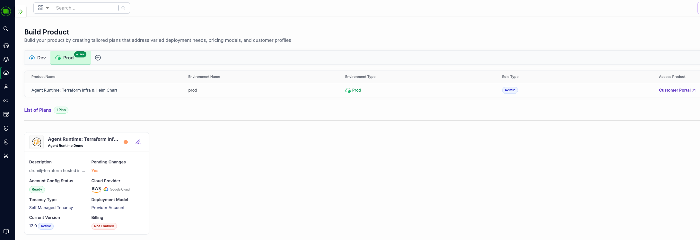
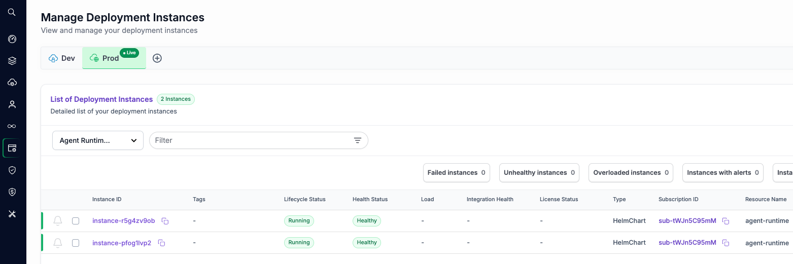

# Agent Runtime SaaS with Terraform and Helm

This example demonstrates how to build an AI Agent Runtime SaaS using Omnistrate's unified Terraform + Helm deployment model. Omnistrate orchestrates the entire lifecycle — provisioning cloud infrastructure via Terraform (PostgreSQL, Redis, KMS) and deploying the application via a Helm chart — all from a single declarative specification.

## Summary

The service defines three resources that Omnistrate manages as a single, coordinated deployment:

| Resource | Type | Purpose |
|----------|------|---------|
| `tf-postgres` | Terraform (internal) | Provisions a managed PostgreSQL database (AWS RDS / GCP Cloud SQL) |
| `tf-redis` | Terraform (internal) | Provisions a managed Redis cache (AWS ElastiCache / GCP Memorystore) |
| `agent-runtime` | Helm chart (customer-facing) | Deploys the Agent Runtime API on Kubernetes |



The key architectural pattern is **infrastructure-as-code composition**: Terraform provisions the backing data stores, and the Helm chart consumes their connection details through Omnistrate's output-variable referencing system (`{{ $tf-postgres.out.host }}`, `{{ $tf-redis.out.host }}`, etc.). Omnistrate handles the dependency ordering, secret propagation, and lifecycle management automatically.

### Features Enabled

| Feature | Configuration | Purpose |
|---------|---------------|---------|
| Provider-Hosted Deployment | `hostedDeployment` | Deploys all infrastructure in your cloud accounts |
| Multi-Cloud Support | AWS + GCP configurations | Terraform and Helm configured for both cloud providers |
| Terraform Infrastructure | `terraformConfigurations` | Managed database and cache provisioned via IaC |
| Variable Overrides | `variablesValuesFileOverride` | System parameters injected as Terraform `.tfvars` at deploy time |
| Helm Chart Deployment | `helmChartConfiguration` | Kubernetes-native application deployment |
| Cross-Resource References | `{{ $tf-postgres.out.* }}` | Terraform outputs flow into Helm chart values |
| Tenant Isolation | `$sys.tenant.*` system parameters | Per-tenant context injected into both Terraform tags and Helm values |
| Custom Terraform Execution Identity | `terraformExecutionIdentity` | Scoped IAM role for Terraform operations on AWS |
| Native Logging | `features.INTERNAL.logs` / `features.CUSTOMER.logs` | Built-in log aggregation for provider and customer |
| Customer-Facing API Parameters | `apiParameters` | Customers configure instance type, replicas, model, and more |
| Public Endpoint | `endpointConfiguration` | HTTPS endpoint exposed to customers on port 443 |

---

## Provider-Hosted Deployment

The service deploys in your cloud accounts on both AWS and GCP. You configure your account credentials in the `deployment` section:

```yaml
deployment:
  hostedDeployment: 
    AwsAccountId: '<AWS_ACCOUNT_ID>'
    GcpProjectId: '<GCP_PROJECT_ID>'
    GcpProjectNumber: '<GCP_PROJECT_NUMBER>'
    GcpServiceAccountEmail: '<GCP_SERVICE_ACCOUNT_EMAIL>'
```

Omnistrate uses these credentials to provision infrastructure in your accounts on behalf of your customers.

---

## Observability

Native logging is enabled for both internal (provider) and customer-facing visibility:

```yaml
features:
  INTERNAL:
    logs: # Omnistrate native logging
  CUSTOMER:
    logs: # Omnistrate native logging
```

This gives you operational visibility into the service while also exposing logs to your end customers through the Omnistrate dashboard.

---

## Terraform Infrastructure Services

Omnistrate manages Terraform resources as **internal services** — they are not directly visible to customers but are provisioned automatically as part of the deployment. Each Terraform service points to a Git repository containing the `.tf` files, and Omnistrate handles `init`, `plan`, `apply`, and `destroy` across the full lifecycle.

### How Terraform Services Are Configured

Each Terraform resource is defined with:

1. **`internal: true`** — Marks it as a backing resource, hidden from customers
2. **`terraformConfigurations`** — Points to Terraform code per cloud provider
3. **`variablesValuesFileOverride`** — Inlines a `.tfvars` file that injects Omnistrate [system parameters](https://docs.omnistrate.com/build-guides/system-parameters/) into the Terraform variables at deploy time
4. **`gitConfiguration`** — Specifies the Git repo, branch, and access token
5. **`terraformExecutionIdentity`** (AWS) — A scoped IAM role for Terraform execution

```yaml
- name: tf-postgres
  internal: true
  terraformConfigurations:
    configurationPerCloudProvider:
      aws:
        terraformPath: /terraform/aws/postgres
        terraformExecutionIdentity: "arn:aws:iam::<AWS_ACCOUNT_ID>:role/omnistrate-custom-terraform-execution-role"
        variablesValuesFileOverride: |
          name = "{{ $sys.id }}"
          user_id = "{{ $sys.tenant.userID }}"
          region = "{{ $sys.deploymentCell.region }}"
          vpc_id = "{{ $sys.deploymentCell.cloudProviderNetworkID }}"
          vpc_cidr = "{{ $sys.deploymentCell.cidrRange }}"
          subnet_ids = [
            "{{ $sys.deploymentCell.privateSubnetIDs[0].id }}",
            "{{ $sys.deploymentCell.privateSubnetIDs[1].id }}",
            "{{ $sys.deploymentCell.privateSubnetIDs[2].id }}"
          ]
        gitConfiguration:
          reference: refs/heads/main
          repositoryUrl: https://github.com/<YOUR_REPO>.git
          accessToken: <YOUR_GITHUB_PAT>
      gcp:
        terraformPath: /terraform/gcp/postgres
        variablesValuesFileOverride: |
          name = "{{ $sys.id }}"
          user_id = "{{ $sys.tenant.userID }}"
          region = "{{ $sys.deploymentCell.region }}"
          project_id = "{{ $sys.deploymentCell.gcp.projectID }}"
        gitConfiguration:
          reference: refs/heads/main
          repositoryUrl: https://github.com/<YOUR_REPO>.git
          accessToken: <YOUR_GITHUB_PAT>
```

The `variablesValuesFileOverride` block is the key mechanism for parameterizing Terraform. Omnistrate resolves the `{{ $sys.* }}` template expressions and writes them into a `.tfvars` file before running `terraform apply`. This keeps the Terraform modules **generic and reusable** — they declare plain variables without hardcoded defaults, and all deployment-specific values come from the override.

### How Omnistrate Manages Terraform

When a customer creates an instance, Omnistrate:

1. **Clones** the Git repository at the specified reference
2. **Generates a `.tfvars` file** from `variablesValuesFileOverride`, resolving all [system parameter](https://docs.omnistrate.com/build-guides/system-parameters/) templates (e.g., `{{ $sys.deploymentCell.region }}`, `{{ $sys.id }}`, `{{ $sys.tenant.userID }}`)
3. **Executes** `terraform init` → `terraform plan` → `terraform apply` with the generated `.tfvars` using the specified execution identity
4. **Captures outputs** (e.g., `host`, `port`, `username`, `password`) and makes them available to dependent resources via `{{ $tf-postgres.out.* }}`
5. **Destroys** infrastructure with `terraform destroy` when the customer deletes their instance

### PostgreSQL (tf-postgres)

Provisions a fully managed PostgreSQL database with the following cloud-provider implementations:

| Cloud | Service | Key Resources |
|-------|---------|---------------|
| AWS | Amazon RDS PostgreSQL 15 | RDS instance, security group, subnet group, SSM parameters, CloudWatch logs |
| GCP | Cloud SQL PostgreSQL 15 | Cloud SQL instance, database, user |

The Terraform modules declare clean, reusable variables — no hardcoded defaults for deployment-specific values:

```hcl
variable "name" {
  description = "Unique name/identifier for the resources"
  type        = string
}

variable "region" {
  description = "AWS region to deploy resources in"
  type        = string
}

variable "vpc_id" {
  description = "VPC ID to deploy the RDS instance in"
  type        = string
}
```

Omnistrate populates these variables at deploy time via `variablesValuesFileOverride`. For AWS, this includes VPC, CIDR, and private subnet details:

```yaml
variablesValuesFileOverride: |
  name = "{{ $sys.id }}"
  user_id = "{{ $sys.tenant.userID }}"
  region = "{{ $sys.deploymentCell.region }}"
  vpc_id = "{{ $sys.deploymentCell.cloudProviderNetworkID }}"
  vpc_cidr = "{{ $sys.deploymentCell.cidrRange }}"
  subnet_ids = [
    "{{ $sys.deploymentCell.privateSubnetIDs[0].id }}",
    "{{ $sys.deploymentCell.privateSubnetIDs[1].id }}",
    "{{ $sys.deploymentCell.privateSubnetIDs[2].id }}"
  ]
```

For GCP, the override is simpler since Cloud SQL does not require subnet configuration:

```yaml
variablesValuesFileOverride: |
  name = "{{ $sys.id }}"
  user_id = "{{ $sys.tenant.userID }}"
  region = "{{ $sys.deploymentCell.region }}"
  project_id = "{{ $sys.deploymentCell.gcp.projectID }}"
```

Terraform outputs are automatically captured and made available to the Helm chart:

```hcl
output "host" {
  value = aws_db_instance.postgres.address
}

output "port" {
  value = tostring(aws_db_instance.postgres.port)
}

output "password" {
  value     = random_password.postgres_password.result
  sensitive = true
}
```

### Redis (tf-redis)

Provisions a managed Redis cache with encryption and authentication:

| Cloud | Service | Key Resources |
|-------|---------|---------------|
| AWS | Amazon ElastiCache Redis 7.0 | Replication group, security group, subnet group, SSM parameters |
| GCP | GCP Memorystore Redis 7.0 | Redis instance with auth and TLS |

Both implementations feature:
- **Encryption at rest and in transit** enabled by default
- **Auto-generated auth tokens** via `random_password`
- **Tenant-aware tagging/labeling** via `user_id` variable injected from `{{ $sys.tenant.userID }}`
- **Clean, reusable modules** — all deployment-specific values supplied through `variablesValuesFileOverride`, keeping the `.tf` files portable

---

## Helm Chart Service (agent-runtime)

The `agent-runtime` service is the customer-facing component deployed via a Helm chart on Omnistrate-managed Kubernetes. It depends on the two Terraform services and consumes their outputs.

### Dependency Declaration

The `dependsOn` field tells Omnistrate to provision Terraform resources before deploying the Helm chart:

```yaml
- name: agent-runtime
  internal: false
  dependsOn:
    - tf-postgres
    - tf-redis
```

### Compute Configuration

Instance types are defined per cloud provider, giving customers a choice of sizing:

```yaml
compute:
  instanceTypes:
    - cloudProvider: aws
      name: t3.large
    - cloudProvider: aws
      name: t3.xlarge
    - cloudProvider: gcp
      name: n2-standard-2
    - cloudProvider: gcp
      name: n2-standard-4
```

### Customer API Parameters

Customers configure their instance through API parameters exposed in the Omnistrate dashboard:

| Parameter | Type | Default | Modifiable | Description |
|-----------|------|---------|------------|-------------|
| `instanceType` | String | `t3.large` | ✅ | Compute instance type |
| `replicaCount` | Float64 | `1` | ✅ | Number of agent runtime replicas |
| `agentName` | String | `default-agent` | ❌ | Name identifier for the agent |
| `logLevel` | String | `info` | ✅ | Logging level (debug/info/warn/error) |
| `anthropicApiKey` | String | — | ✅ | API key for Anthropic LLM (not exported) |
| `defaultModel` | String | `claude-sonnet-4-5` | ✅ | Default LLM model |
| `maxExecutionTime` | String | `300` | ✅ | Max execution time in seconds |
| `maxRetries` | String | `3` | ✅ | Max retries for failed operations |
| `enableTenantIsolation` | String | `true` | ✅ | Multi-tenant isolation toggle |

These parameters are referenced in the Helm chart values using `$var.<key>` syntax:

```yaml
chartValues:
  agentApi:
    replicaCount: "$var.replicaCount"
    config:
      defaultModel: "$var.defaultModel"
      maxExecutionTime: "$var.maxExecutionTime"
```

### Helm Chart Configuration

The chart is pulled from an OCI-compatible container registry:

```yaml
helmChartConfiguration:
  chartName: agent-runtime
  chartVersion: "0.4.0"
  chartRepoName: omnistrate-community
  chartRepoURL: oci://ghcr.io/omnistrate-community/agent-runtime
  authProvider:
    username: <YOUR_REGISTRY_USERNAME>
    password: <YOUR_REGISTRY_PAT>
```

### Cross-Resource References (Terraform → Helm)

The most powerful aspect of this architecture is how Terraform outputs flow into Helm chart values. Omnistrate resolves these references at deployment time:

**PostgreSQL connection details:**

```yaml
externalPostgresql:
  host: "{{ $tf-postgres.out.host }}"
  port: "{{ $tf-postgres.out.port }}"
  username: "{{ $tf-postgres.out.username }}"
  password: "{{ $tf-postgres.out.password }}"
  database: "{{ $tf-postgres.out.database }}"
```

**Redis connection details:**

```yaml
externalRedis:
  host: "{{ $tf-redis.out.host }}"
  port: "{{ $tf-redis.out.port }}"
  password: "{{ $tf-redis.out.password }}"
```

The in-chart PostgreSQL and Redis subcharts are disabled since we use Terraform-managed external instances:

```yaml
postgresql:
  enabled: false

redis:
  enabled: false
```

### Tenant Context Injection

Omnistrate system parameters inject per-tenant identity into the Helm values, enabling multi-tenant isolation at the application layer:

```yaml
tenant:
  id: "{{ $sys.tenant.userID }}"
  email: "{{ $sys.tenant.email }}"
  name: "{{ $sys.tenant.name }}"
  orgId: "{{ $sys.tenant.orgId }}"
  orgName: "{{ $sys.tenant.orgName }}"
```

### Node Affinity

The Helm chart uses Omnistrate node labels to ensure pods are scheduled on the correct Omnistrate-managed nodes:

```yaml
affinity:
  nodeAffinity:
    requiredDuringSchedulingIgnoredDuringExecution:
      nodeSelectorTerms:
        - matchExpressions:
            - key: omnistrate.com/managed-by
              operator: In
              values:
                - omnistrate
            - key: topology.kubernetes.io/region
              operator: In
              values:
                - "{{ $sys.deploymentCell.region }}"
            - key: node.kubernetes.io/instance-type
              operator: In
              values:
                - "{{ $sys.compute.node.instanceType }}"
            - key: omnistrate.com/resource
              operator: In
              values:
                - "{{ $sys.deployment.resourceID }}"
```

### Endpoint Configuration

The service exposes a public HTTPS endpoint on port 443 for customer access:

```yaml
endpointConfiguration:
  primary:
    host: "$sys.network.externalClusterEndpoint"
    ports:
      - 443
    primary: true
    networkingType: PUBLIC
```

The load balancer annotations in the Helm values configure AWS NLB with external DNS:

```yaml
service:
  type: LoadBalancer
  port: 443
  targetPort: 8000
  annotations:
    external-dns.alpha.kubernetes.io/hostname: "$sys.network.externalClusterEndpoint"
    service.beta.kubernetes.io/aws-load-balancer-scheme: internet-facing
    service.beta.kubernetes.io/aws-load-balancer-type: external
    service.beta.kubernetes.io/aws-load-balancer-nlb-target-type: ip
```

---

## Deployment Lifecycle

When a customer creates an instance through the Omnistrate dashboard or API, the platform orchestrates the following sequence:

1. **Terraform: PostgreSQL** — Provisions an RDS instance (AWS) or Cloud SQL instance (GCP) with auto-generated credentials
2. **Terraform: Redis** — Provisions an ElastiCache replication group (AWS) or Memorystore instance (GCP) with auth tokens
3. **Helm Chart: Agent Runtime** — Deploys the application with Terraform outputs injected as database/cache connection strings, tenant context from system parameters, and customer-configured API parameters
4. **Endpoint** — A public HTTPS endpoint is provisioned and returned to the customer

On instance deletion, Omnistrate reverses the process — tearing down the Helm release first and then destroying Terraform resources.



---

## Complete Spec

```yaml
# yaml-language-server: $schema=https://api.omnistrate.cloud/2022-09-01-00/schema/service-spec-schema.json

name: Agent Runtime Demo

deployment:
  hostedDeployment: 
      AwsAccountId: '<AWS_ACCOUNT_ID>'
      GcpProjectId: '<GCP_PROJECT_ID>'
      GcpProjectNumber: '<GCP_PROJECT_NUMBER>'
      GcpServiceAccountEmail: '<GCP_SERVICE_ACCOUNT_EMAIL>'

features:
  INTERNAL:
    logs: # Omnistrate native logging
  CUSTOMER:
    logs: # Omnistrate native logging

services:
  # PostgreSQL Database Infrastructure
  - name: tf-postgres
    internal: true
    terraformConfigurations:
      configurationPerCloudProvider:
        aws:
          terraformPath: /terraform/aws/postgres
          terraformExecutionIdentity: "arn:aws:iam::<AWS_ACCOUNT_ID>:role/omnistrate-custom-terraform-execution-role"
          variablesValuesFileOverride: |
            name = "{{ $sys.id }}"
            user_id = "{{ $sys.tenant.userID }}"
            region = "{{ $sys.deploymentCell.region }}"
            vpc_id = "{{ $sys.deploymentCell.cloudProviderNetworkID }}"
            vpc_cidr = "{{ $sys.deploymentCell.cidrRange }}"
            subnet_ids = [
              "{{ $sys.deploymentCell.privateSubnetIDs[0].id }}",
              "{{ $sys.deploymentCell.privateSubnetIDs[1].id }}",
              "{{ $sys.deploymentCell.privateSubnetIDs[2].id }}"
            ]
          gitConfiguration:
            reference: refs/heads/main
            repositoryUrl: https://github.com/<YOUR_REPO>.git
            accessToken: <YOUR_GITHUB_PAT>
        gcp:
          terraformPath: /terraform/gcp/postgres
          variablesValuesFileOverride: |
            name = "{{ $sys.id }}"
            user_id = "{{ $sys.tenant.userID }}"
            region = "{{ $sys.deploymentCell.region }}"
            project_id = "{{ $sys.deploymentCell.gcp.projectID }}"
          gitConfiguration:
            reference: refs/heads/main
            repositoryUrl: https://github.com/<YOUR_REPO>.git
            accessToken: <YOUR_GITHUB_PAT>

  # Redis Cache Infrastructure
  - name: tf-redis
    internal: true
    terraformConfigurations:
      configurationPerCloudProvider:
        aws:
          terraformPath: /terraform/aws/redis
          terraformExecutionIdentity: "arn:aws:iam::<AWS_ACCOUNT_ID>:role/omnistrate-custom-terraform-execution-role"
          variablesValuesFileOverride: |
            name = "{{ $sys.id }}"
            user_id = "{{ $sys.tenant.userID }}"
            region = "{{ $sys.deploymentCell.region }}"
            vpc_id = "{{ $sys.deploymentCell.cloudProviderNetworkID }}"
            vpc_cidr = "{{ $sys.deploymentCell.cidrRange }}"
            subnet_ids = [
              "{{ $sys.deploymentCell.privateSubnetIDs[0].id }}",
              "{{ $sys.deploymentCell.privateSubnetIDs[1].id }}",
              "{{ $sys.deploymentCell.privateSubnetIDs[2].id }}"
            ]
          gitConfiguration:
            reference: refs/heads/main
            repositoryUrl: https://github.com/<YOUR_REPO>.git
            accessToken: <YOUR_GITHUB_PAT>
        gcp:
          terraformPath: /terraform/gcp/redis
          variablesValuesFileOverride: |
            name = "{{ $sys.id }}"
            user_id = "{{ $sys.tenant.userID }}"
            region = "{{ $sys.deploymentCell.region }}"
            project_id = "{{ $sys.deploymentCell.gcp.projectID }}"
          gitConfiguration:
            reference: refs/heads/main
            repositoryUrl: https://github.com/<YOUR_REPO>.git
            accessToken: <YOUR_GITHUB_PAT>

  # Agent Runtime Helm Chart - Main Service
  - name: agent-runtime
    internal: false
    dependsOn:
      - tf-postgres
      - tf-redis
    compute:
      instanceTypes:
        - cloudProvider: aws
          name: t3.large
        - cloudProvider: aws
          name: t3.xlarge
        - cloudProvider: gcp
          name: n2-standard-2
        - cloudProvider: gcp
          name: n2-standard-4
    network:
      ports:
        - 8000
        - 443
    
    # API Parameters exposed to customers
    apiParameters:
      - key: instanceType
        name: Instance Type
        description: Compute instance type for the agent runtime
        type: String
        required: false
        defaultValue: "t3.large"
        modifiable: true
        export: true

      - key: replicaCount
        name: Replica Count
        description: Number of agent runtime replicas
        type: Float64
        required: false
        defaultValue: "1"
        modifiable: true
        export: true

      - key: agentName
        name: Agent Name
        description: Name identifier for the agent
        type: String
        required: true
        defaultValue: "default-agent"
        modifiable: false
        export: true

      - key: logLevel
        name: Log Level
        description: Logging level for the agent runtime
        type: String
        required: false
        defaultValue: "info"
        modifiable: true
        export: true
        options:
          - "debug"
          - "info"
          - "warn"
          - "error"

      - key: anthropicApiKey
        name: Anthropic API Key
        description: API key for Anthropic LLM provider
        type: String
        required: true
        modifiable: true
        export: false

      - key: defaultModel
        name: Default Model
        description: Default LLM model to use
        type: String
        required: false
        defaultValue: "claude-sonnet-4-5"
        modifiable: true
        export: true

      - key: maxExecutionTime
        name: Max Execution Time
        description: Maximum execution time in seconds for agent tasks
        type: String
        required: false
        defaultValue: "300"
        modifiable: true
        export: true

      - key: maxRetries
        name: Max Retries
        description: Maximum number of retries for failed operations
        type: String
        required: false
        defaultValue: "3"
        modifiable: true
        export: true

      - key: enableTenantIsolation
        name: Enable Tenant Isolation
        description: Enable multi-tenant isolation
        type: String
        required: false
        defaultValue: "true"
        modifiable: true
        export: true
        options:
          - "true"
          - "false"

    # Helm Chart Configuration
    helmChartConfiguration:
      chartName: agent-runtime
      chartVersion: "0.4.0"
      chartRepoName: omnistrate-community
      chartRepoURL: oci://ghcr.io/omnistrate-community/agent-runtime
      authProvider:
        username: <YOUR_REGISTRY_USERNAME>
        password: <YOUR_REGISTRY_PAT>
      
      # Chart Values - Mapped to helm-chart/values.yaml structure
      chartValues:
        # Agent Runtime API Configuration
        agentApi:
          replicaCount: "$var.replicaCount"

          image:
            repository: omnistrate/agent-runtime
            tag: latest
            pullPolicy: IfNotPresent

          imagePullSecrets:
            - name: agent-runtime-pull-secret

          service:
            type: LoadBalancer
            port: 443
            targetPort: 8000
            annotations:
              external-dns.alpha.kubernetes.io/hostname: "$sys.network.externalClusterEndpoint"
              service.beta.kubernetes.io/aws-load-balancer-scheme: internet-facing
              service.beta.kubernetes.io/aws-load-balancer-type: external
              service.beta.kubernetes.io/aws-load-balancer-nlb-target-type: ip

          # API and agent configuration
          config:
            apiHost: "0.0.0.0"
            apiPort: "8000"
            defaultModel: "$var.defaultModel"
            maxExecutionTime: "$var.maxExecutionTime"
            maxRetries: "$var.maxRetries"
            enableTenantIsolation: "$var.enableTenantIsolation"

          # Tenant configuration from Omnistrate system parameters
          tenant:
            id: "{{ $sys.tenant.userID }}"
            email: "{{ $sys.tenant.email }}"
            name: "{{ $sys.tenant.name }}"
            orgId: "{{ $sys.tenant.orgId }}"
            orgName: "{{ $sys.tenant.orgName }}"

          # Secrets for LLM provider
          secrets:
            anthropicApiKeySecret: "agent-secrets"
            anthropicApiKeyKey: "ANTHROPIC_API_KEY"
            anthropicApiKey: "$var.anthropicApiKey"

          resources:
            limits:
              cpu: 1000m
              memory: 1024Mi
            requests:
              cpu: 250m
              memory: 512Mi

          healthcheck:
            enabled: true
            path: /health
            initialDelaySeconds: 40
            periodSeconds: 30
            timeoutSeconds: 10
            failureThreshold: 3

          # Pod affinity for Omnistrate managed nodes
          affinity:
            nodeAffinity:
              requiredDuringSchedulingIgnoredDuringExecution:
                nodeSelectorTerms:
                  - matchExpressions:
                      - key: omnistrate.com/managed-by
                        operator: In
                        values:
                          - omnistrate
                      - key: topology.kubernetes.io/region
                        operator: In
                        values:
                          - "{{ $sys.deploymentCell.region }}"
                      - key: node.kubernetes.io/instance-type
                        operator: In
                        values:
                          - "{{ $sys.compute.node.instanceType }}"
                      - key: omnistrate.com/resource
                        operator: In
                        values:
                          - "{{ $sys.deployment.resourceID }}"

        # PostgreSQL - Disabled (using external Terraform-managed instance)
        postgresql:
          enabled: false
          auth:
            database: "{{ $tf-postgres.out.database }}"
            username: "{{ $tf-postgres.out.username }}"
            password: "{{ $tf-postgres.out.password }}"

        # External PostgreSQL connection (passed to helpers template)
        externalPostgresql:
          host: "{{ $tf-postgres.out.host }}"
          port: "{{ $tf-postgres.out.port }}"
          username: "{{ $tf-postgres.out.username }}"
          password: "{{ $tf-postgres.out.password }}"
          database: "{{ $tf-postgres.out.database }}"

        # Redis - Disabled (using external Terraform-managed instance)
        redis:
          enabled: false
          architecture: standalone
          auth:
            enabled: false
          tls:
            enabled: false

        # External Redis connection (passed to helpers template)
        externalRedis:
          host: "{{ $tf-redis.out.host }}"
          port: "{{ $tf-redis.out.port }}"
          password: "{{ $tf-redis.out.password }}"

        # Ingress Configuration - Disabled (Omnistrate L7 load balancer handles external HTTPS routing)
        ingress:
          enabled: false

        # Service Account
        serviceAccount:
          create: true
          annotations: {}
          name: ""

    # Endpoint configuration - exposes connectivity details to customers
    endpointConfiguration:
      primary:
        host: "$sys.network.externalClusterEndpoint"
        ports:
          - 443
        primary: true
        networkingType: PUBLIC
```

---

## Next Steps

After deploying your Agent Runtime SaaS, you can extend the offering:

- Add [BYOA deployment](https://docs.omnistrate.com/build-guides/deployment-models/#bring-your-own-cloud-byoc) to let enterprise customers run in their own accounts
- Configure [custom Terraform policies](https://docs.omnistrate.com/getting-started/build-from-terraform/#additional-permissions-for-terraform) for BYOA models
- Enable [autoscaling](https://docs.omnistrate.com/runtime-guides/overview/) for the Helm-based agent runtime
- Add [custom metrics](https://docs.omnistrate.com/build-guides/integrations/#metrics) for application-level observability
- Set up [upgrades](https://docs.omnistrate.com/dev-ops-guides/upgrades/) for rolling out new versions of the Terraform stacks and Helm chart
